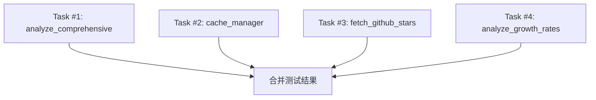

# Codex Task Prompts

**生成日期**: 2026-02-04
**生成原因**: 代码质量审查发现测试覆盖率过低（37%，目标 70%+）

---

## 📊 Codex 任务分析报告

### 适配性评分: **88%（强烈推荐 Codex）**

| 检查项 | 评分 | 原因 |
|--------|------|------|
| 任务类型 | 90% | 测试编写 - Codex 擅长 |
| 需求明确度 | 85% | 需求清晰，有明确覆盖率目标 |
| 交互需求 | 80% | 可独立完成 |
| 技术栈 | 95% | Python + pytest - Codex 非常擅长 |

---

## 📋 任务列表

共拆分为 **4 个独立子任务**，可并行执行：

| 任务 | 文件 | 当前覆盖 | 目标覆盖 | 预计时间 |
|------|------|---------|---------|----------|
| Task #1 | test_analyze_comprehensive.py | 11% | 70% | 45min |
| Task #2 | test_cache_manager.py | 13% | 80% | 30min |
| Task #3 | test_fetch_github_stars.py | 21% | 75% | 30min |
| Task #4 | test_analyze_growth_rates.py | 27% | 75% | 30min |

---

## 📁 Prompts 文件

```
codex-prompts/
├── README.md                                  # 本文件
├── 2026-02-04-task-1-test-analyze-comprehensive.md
├── 2026-02-04-task-2-test-cache-manager.md
├── 2026-02-04-task-3-test-fetch-github-stars.md
└── 2026-02-04-task-4-test-analyze-growth-rates.md
```

---

## ⚡ 执行建议

### 并行执行（推荐）

所有 4 个任务可以**同时**发送给 Codex，因为它们没有依赖关系：

```bash
# 复制 Task #1 内容发给 Codex
cat codex-prompts/2026-02-04-task-1-test-analyze-comprehensive.md

# 复制 Task #2 内容发给 Codex
cat codex-prompts/2026-02-04-task-2-test-cache-manager.md

# 复制 Task #3 内容发给 Codex
cat codex-prompts/2026-02-04-task-3-test-fetch-github-stars.md

# 复制 Task #4 内容发给 Codex
cat codex-prompts/2026-02-04-task-4-test-analyze-growth-rates.md
```

### 依赖关系图



**结论**: 无依赖，可完全并行。

---

## ⏱️ 时间预估

| 项目 | 时间 |
|------|------|
| **串行执行总时间** | 135 分钟 |
| **并行执行总时间** | 45 分钟（最长任务时间） |
| **并行可节省** | 90 分钟 |

---

## 🔄 后续步骤

1. **发送任务给 Codex**
2. **收到代码后验证**：
   ```bash
   cd skill-trending-monitor-cskill
   source .venv/bin/activate
   pytest tests/ -v --cov=scripts --cov-report=term-missing
   ```
3. **合并 PR**
4. **更新代码质量报告**

---

## 📊 预期成果

完成后测试覆盖率变化：

| 模块 | 变化前 | 变化后 |
|------|--------|--------|
| analyze_comprehensive.py | 11% | 70%+ |
| cache_manager.py | 13% | 80%+ |
| fetch_github_stars.py | 21% | 75%+ |
| analyze_growth_rates.py | 27% | 75%+ |
| **整体覆盖率** | **37%** | **预计 55-60%** |

---

**注意**: 完成这 4 个任务后，建议继续为其他低覆盖模块添加测试，最终目标是整体覆盖率 70%+。
